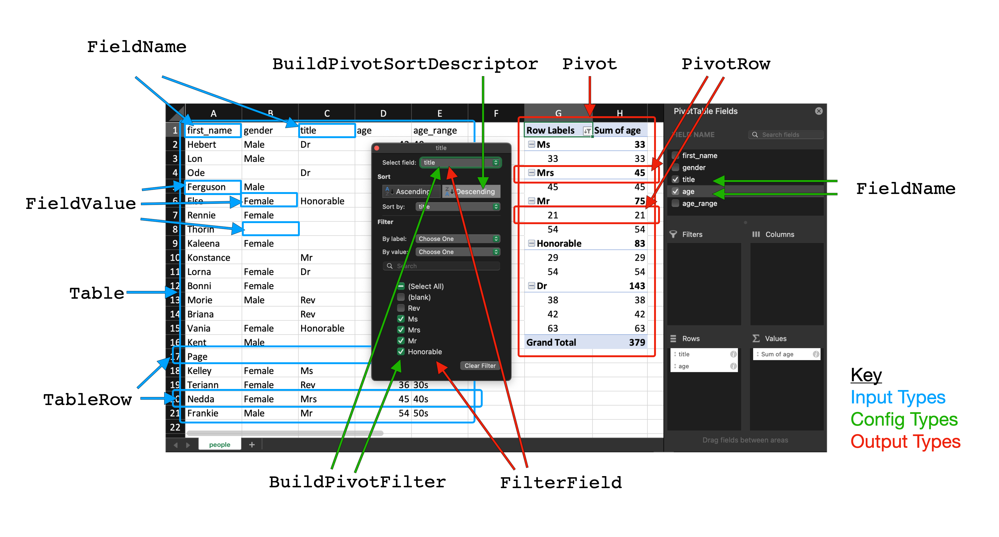

# PeakPivot

[](https://github.com/3Squared/PeakPivot/actions/workflows/swift.yml)

<!--  --->

[Wikipedia](https://en.wikipedia.org/wiki/Pivot_table) says:

> Pivot tables are a technique in data processing. They arrange and rearrange (or "pivot") statistics in order to draw attention to useful information. This leads to finding figures and facts quickly making them integral to data analysis. 

PeakPivot is a pure-swift implementation of pivot tables modelled on the implementation offered by Microsoft Excel and Google Sheets. PeakPivot provides the base types and business logic for summarising tabular data into a pivot table.

## Types 

PeakPivot defines a number of types that model

1. The **input** data necessary for building a pivot table,
2. The **configuration** values for a pivot table builder, 
3. The resulting **output** pivot table.

Below is screenshot of a pivot table built in Microsoft Excel from the [`people.csv`](Assets/people.csv) file. It is annotated to show the corresponding PeakPivot types.



### 1. Input 

These types are the input to the pivot building logic. They are highlighted in blue in the [diagram above](#Types).

`Table`. A array of `TableRow`s. This is the input to data to be pivotted. For example this may come from a CSV file.

`TableRow`. A key-value pair of `[FieldName : FieldValue]`. This represents a single row in a table. If using a CSV the `FieldName` corresponds to the column-name, and the `FieldValue` corresponds to the column-value for that row.

`FieldName`. A string representing a column-name in the input table.

`FieldValue`. A string representing a cell-value for a given column and row. Note that `String` is used as the type here to make it easier for CSV parsing and conforming `FieldValue` to `Equatable` (necessary for unit testing). Any non-string value can be boxed into a `FieldValue` if required.

### 2. Builder Configuration

These types configure the pivot that is built. They are highlighted in green in the [diagram above](#Types).

`BuildPivot`. A protocol defining the business logic for building a pivot from a supplied `Table` and array of `FieldName`s to pivot around. A protocol extension provides a default implementation of the `build()` function. Either conform a type to `BuildPivot` or use the provided concrete implementation `PivotBuilder`.

`PivotBuilder`. A concrete implementation of the `BuildPivot` protocol that provides defaults for the configuration varaibles.

`FieldName`. A string representing a column-name from the input table to pivot around.

`BuildPivotFilter`. Describes how to apply a filter to a pivot table to exclude certain `FieldName`s and values.

`BuildPivotDescriptor`. Describes how to apply a sort to pivot table.

### 3. Output

These types are the output from the pivot building logic. They are highlighted in red in the [diagram above](#Types).

`Pivot`. A pivot table, generated by processing a `Table` using a `BuildPivot`. Defines the `PivotRow`s in the output table, the `FilterField`s that can be used for subsequent filting, and the total number of rows in the table.

`PivotRow`. A row in a pivot table, that stores the computed value information (the count, sum, percentage etc), what level in the overall table is sits at, it's title (corresponds to the `FieldName` in the input `Table`), and any subrows it has. The subrows represent the nesting of groups in a pivot table. The number of levels to this nesting is equal to  (number of `FieldName`s - 1) as passed into the `BuildPivot`.

`FilterField`. All the fields from a generated pivot table that can be used to filter the pivot table on a subsequent build. Use these `FilterField`s to create `BuildPivotFilter`s as needed.

## Building a Pivot

To recreate the pivot table shown in the [Excel spreadsheet above](#Types) we load in the [`people.csv`](Assets/people.csv) csv file using SwiftCSV (including with PeakPivot) and construct a `PivotBuilder` with the corresponding input and configuration data.

Set the `fields` variable to the `FieldName`s you want to group the pivot table using. The last `FieldName` in the array defines the `FieldValue`s in the input `Table` to summarise using sum, count and percentage operators.

Once configured call the `build()` function.

```swift
do {
    let csvURL = URL(fileURLWithPath: "url/to/people.csv")
    let csv = try CSV(url: csvURL)
    let csvRows = csv.namedRows

    let builder = PivotBuilder()
    
    // Set the input
    builder.table = csvRows
    builder.fields = ["title", "age"] // "age" is summarised
    
    // Configure the builder
    builder.sortDescriptor = .byTitle(ascending: false) 
    builder.filters = [BuildPivotFilter(fieldName: "title", exclude: ["Blank", "Rev"])] // exclude "Blank" and "Rev" from the pivot table
    builder.sumsEnabled = true // compute sums
    builder.percentagesEnabled = true // compute percentages

    // Run the builder
    let pivot = try builder.build()
    
    // Below are examples of the output 
    // pivot.rows will equal
    let pivotRows = [
    PivotRow(level: 0, title: "Ms", value: PivotRow.Value(count: 1, sum: 33, percentage: 1/9), subRows: [
        PivotRow(level: 1, title: "33", value: PivotRow.Value(count: 1, sum: 33, percentage: 1/9), subRows: nil),
    ]),
    PivotRow(level: 0, title: "Mrs", value: PivotRow.Value(count: 1, sum: 45, percentage: 1/9), subRows: [
        PivotRow(level: 1, title: "45", value: PivotRow.Value(count: 1, sum: 45, percentage: 1/9), subRows: nil),
    ]),
    PivotRow(level: 0, title: "Mr", value: PivotRow.Value(count: 2, sum: 75, percentage: 2/9), subRows: [
        PivotRow(level: 1, title: "54", value: PivotRow.Value(count: 1, sum: 54, percentage: 1/9), subRows: nil),
        PivotRow(level: 1, title: "21", value: PivotRow.Value(count: 1, sum: 21, percentage: 1/9), subRows: nil),
    ]),
    PivotRow(level: 0, title: "Honorable", value: PivotRow.Value(count: 2, sum: 83, percentage: 2/9), subRows: [
        PivotRow(level: 1, title: "54", value: PivotRow.Value(count: 1, sum: 54, percentage: 1/9), subRows: nil),
        PivotRow(level: 1, title: "29", value: PivotRow.Value(count: 1, sum: 29, percentage: 1/9), subRows: nil),
    ]),
    PivotRow(level: 0, title: "Dr", value: PivotRow.Value(count: 3, sum: 143, percentage: 3/9), subRows: [
        PivotRow(level: 1, title: "63", value: PivotRow.Value(count: 1, sum: 63, percentage: 1/9), subRows: nil),
        PivotRow(level: 1, title: "42", value: PivotRow.Value(count: 1, sum: 42, percentage: 1/9), subRows: nil),
        PivotRow(level: 1, title: "38", value: PivotRow.Value(count: 1, sum: 38, percentage: 1/9), subRows: nil),
    ])

    // pivot.total will equal
    let pivotTotal = 9

    // pivot.fieldFields will equal
    let filterFields = [
        FilterField(name: "title", values: [
            "Dr",
            "Honorable",
            "Mr",
            "Mrs",
            "Ms",
            "Rev",
            Blank
        ]),
        FilterField(name: "age", values: [
            "21",
            "25",
            "29",
            "33",
            "35",
            "36",
            "38",
            "40",
            "41",
            "42",
            "44",
            "45",
            "52",
            "54",
            "57",
            "58",
            "63",
            "68"
        ])
    ]

]

} catch  {
    // Handle errors
}

```

For more examples of how to use PeakPivot see the [unit tests](Tests/PeakPivotTests). There is also a basic [example iOS project](Example) that uses PeakPivot.

## Installation

PeakPivot supports the Swift Package Manager. Add the PeakPivot dependency in your `package.swift`.

```swift
dependencies: [
    .package(
        url: "https://github.com/3squared/PeakPivot.git",
        .upToMajor(from: "2.0.0")
    ),
]
```

## License

This project is licensed under the MIT License - see the [LICENSE](LICENSE) file for details

## Acknowledgments

* [SwiftCSV](https://github.com/swiftcsv/SwiftCSV)

# Peak Framework

The Peak Framework is a collection of open-source microframeworks created by the team at [3Squared](https://github.com/3squared), named for the [Peak District](https://en.wikipedia.org/wiki/Peak_District). It is made up of:

|Name|Description|
|:--|:--|
|[PeakOperation](https://github.com/3squared/PeakOperation)|Provides enhancement and conveniences to `Operation`, making use of the `Result` type.|
|[PeakNetwork](https://github.com/3squared/PeakNetwork)|A networking framework built on top of `Session` using PeakOperation, leveraging the power of `Codable`.|
|[PeakCoreData](https://github.com/3squared/PeakCoreData)|Provides enhances and conveniences to `Core Data`.|
